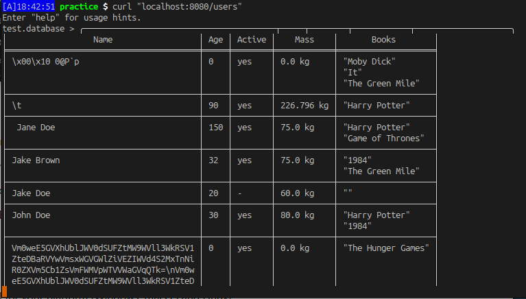

# Практичні

## Запуск

Запускається проект виконанням

```term
go run . [FILE]
```

Тут перший аргумент `[FILE]` — опціональний, назва файлу з даними. Якщо конкретний файл не вказано, то застосунок за замовчанням відкриє файл, що знаходиться за відносною адресою `./datafiles/test.database`, в разі відсутності такого файла, програма створить його.

Для прикладу я користуюсь файлом `original.database`. В такому разі запуск проекту буде виглядати як

```term
go run . ./datafiles/original.database
```

Але легше його перейменувати в `test.database` і тоді в командному рядку взагалі не потрібно буде вказувати адресу файла, щоб його відкрити.

## Text user interface

Під час запуску піднімаються TCP-сервер бази даних, HTTP-сервер для (потенційного) API і текстовий інтерфейс функцією `tui.Prompt`. На текстовому інтерфейсі тримається час виконання програми, аж допоки користувач не введе команду `quit`, або `exit`. *Тому я і не використовую очікування значень від каналу, але сигнатури функцій поки що вирішив не правити, тому просто закриваю канал перед виходом з програми*. В терміналі виконання програми виглядає ось так:


Якщо хочемо створити новий файл з порожньою БД, запускаємо програму з відповідним аргументом, і переконуємось, що файл порожній:


До речі, в строку запиту додав відображення назви файлу БД для зручності.

## TCP-сервер бази даних

Функціонує аналогічно текстовому інтерфейсу основного процесу. Можна підключитись по 8000 порту. Наприклад так:

```term
nc localhost 8000
```

`quit`, або `exit` завершить сесію. Основний процес (з текстовим інтерфейсом) це не зачепить.

## HTTP-сервер

Доступний на порту 8080. Наразі, якщо відправити запит на `localhost:8080/users`, то ми отримаємо майже те, що побачимо при команді `show` в TUI, але з багом. Чогось залишок таблиці не доходить і процес підвисає. Виглядає так:



Поки що не розібрався з цим, але думаю, що для більш реальної моделі передачі даних між серверами варто написати окремий хендлєр на сервері БД, який би обробляв запити від api. Наприклад, спитав би у БД (зв'язка http-tcp), скільки в неї юзерів всього, а потім би міг отримати дані про якогось з цих юзерів і відповісти джейсоном (зв'язка api-світ).

## Хід рішень завдань

|  # | Короткий опис                                                  | Умова | Рішення |
|---:|:---------------------------------------------------------------|-------|---------|
|  1 | Вивести усіх користувачів таблицею у консоль через `Printf`... | [#1](https://github.com/grescher/goc-s2-psets/issues/1) | [p1.0](https://github.com/grescher/goc-s2-psets/releases/tag/p1.0) |
|  2 | До таблиці додати перелік книжок, порахувати середній вік...   | [#2](https://github.com/grescher/goc-s2-psets/issues/2) | [p2.0](https://github.com/grescher/goc-s2-psets/releases/tag/p2.0) |
|  3 | Відсортувати користувачів за сумою середн. віку читача кожної книжки ... | [#5](https://github.com/grescher/goc-s2-psets/issues/5) | [p3.0](https://github.com/grescher/goc-s2-psets/releases/tag/p3.0) |
|  4 | Типізовані константи: додати поле "тип користувача"...         | [#6](https://github.com/grescher/goc-s2-psets/issues/6) | [p4.0](https://github.com/grescher/goc-s2-psets/releases/tag/p4.0) |
|  5 | Декодування даних з бінарного буферу                           | [#8](https://github.com/grescher/goc-s2-psets/issues/8) | [p5.0](https://github.com/grescher/goc-s2-psets/releases/tag/p5.0) |
|  6 | Спільний індекс — стан активності користувачів                 | [#10](https://github.com/grescher/goc-s2-psets/issues/10) | [p6.0](https://github.com/grescher/goc-s2-psets/releases/tag/p6.0) |
|  7 | Збереження у файл. Елементарний інтерпретатор на `Scanf`       | [#12](https://github.com/grescher/goc-s2-psets/issues/12) | [p7.0](https://github.com/grescher/goc-s2-psets/releases/tag/p7.0) |
|  8 | Розпізнавання виразів з цифрами. Буферизований ввод.           | [#13](https://github.com/grescher/goc-s2-psets/issues/13) | |
|  9 | Пересилання даних між клієнтом і сервером                      | [#14](https://github.com/grescher/goc-s2-psets/issues/14) | [p8.0](https://github.com/grescher/goc-s2-psets/releases/tag/p8.0)|
| 10 | http-сервер, який отримує дані з БД (API)                      | [#15](https://github.com/grescher/goc-s2-psets/issues/15) | |
| 11 | Реалізація одночасних запитів на http-сервер                   | | |
| 12 | Запустити наш застосунок в Докері (Dockerfile)                 | [#17](https://github.com/grescher/goc-s2-psets/issues/17) | |
